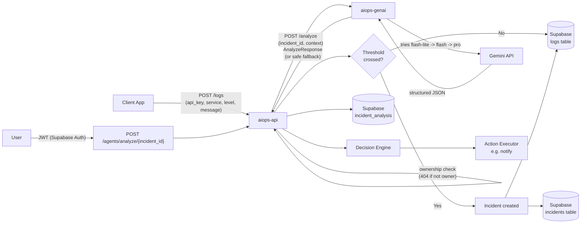

# AI Ops Copilot — Developer Documentation

[](https://github.com/dev-m03/AI-Ops-Copilot/actions/workflows/ci.yml)

AI Ops Copilot is a lightweight, AI-powered incident analysis platform that plugs into any backend with a single API key. It ingests logs, groups incidents, performs AI-driven root cause analysis, and triggers safe automated actions.

## Architecture



---

## Getting Started

### 1. Create an Account

* Visit the AI Ops Copilot website: www.aiopsco.vercel.app
* Sign up using email & password
* Log in to access your dashboard

---

## Create a Project & API Key

1. Go to **Dashboard**
2. Click **Create Project**
3. Enter a project name
4. Copy the generated **API Key**

> Keep this key secret. It is write-only and scoped to your project.

---

## Environment Variables

```env
AIOPS_API_KEY=ops_xxxxxxxxx
AIOPS_ENDPOINT=https://aiops-api.onrender.com/logs
```

---

## Log Ingestion API

### Endpoint

```
POST https://aiops-api.onrender.com/logs
```

### Headers

```
Content-Type: application/json
```

> Note: unlike most APIs, your API key is **not** sent as a header here — it goes in the request body (see below). This endpoint doesn't require a login token either; the `api_key` alone identifies your project.

### Request Body

```json
{
  "api_key": "ops_xxxxxxxxx",
  "service": "auth-service",
  "level": "ERROR",
  "message": "Database connection timeout",
  "idempotency_key": null
}
```

| Field | Required | Description |
|---|---|---|
| `api_key` | Yes | Your project's API key |
| `service` | Yes | Name of the service/app this log came from |
| `level` | Yes | One of `ERROR`, `WARN`, `INFO`, `DEBUG` |
| `message` | Yes | The log/error message |
| `idempotency_key` | No | Supply your own to control deduplication explicitly, or omit it and one is auto-computed from `(project_id, service, level, message)` within a rolling time window — identical repeats within that window are treated as the same log entry and won't create duplicate rows or double-count toward incident thresholds |

### Response

```json
{
  "id": "b4307efb-b758-4efe-88d0-e982c6c2...",
  "project_id": "a4397fe4-75dd-4f0c-8e08-517e...",
  "incident_created": false,
  "incident_id": null,
  "deduplicated": false
}
```

| Field | Description |
|---|---|
| `incident_created` | `true` if this log crossed the error threshold and opened a new incident |
| `incident_id` | Set whenever this log is associated with an incident (new or already-open) |
| `deduplicated` | `true` if this exact log was treated as a repeat and no new row was written |

---

## Backend Integration Examples

### FastAPI (Python)

```python
import os, requests
from fastapi import FastAPI, Request

app = FastAPI()

@app.middleware("http")
async def aiops_logger(request: Request, call_next):
    try:
        return await call_next(request)
    except Exception as e:
        requests.post(
            "https://aiops-api.onrender.com/logs",
            json={
                "api_key": os.getenv("AIOPS_API_KEY"),
                "service": "fastapi-app",
                "level": "ERROR",
                "message": str(e),
            },
            timeout=5
        )
        raise
```

### Spring Boot (Java)

```java
@RestControllerAdvice
public class GlobalExceptionHandler {

  @Value("${aiops.api-key}")
  private String apiKey;

  @ExceptionHandler(Exception.class)
  public void handle(Exception ex, HttpServletRequest req) {
    RestTemplate rest = new RestTemplate();
    HttpHeaders headers = new HttpHeaders();
    headers.setContentType(MediaType.APPLICATION_JSON);

    Map<String, Object> body = Map.of(
      "api_key", apiKey,
      "service", "springboot-app",
      "level", "ERROR",
      "message", ex.getMessage()
    );

    rest.postForEntity(
      "https://aiops-api.onrender.com/logs",
      new HttpEntity<>(body, headers),
      String.class
    );
  }
}
```

### Node.js (Express)

```js
import axios from "axios";

app.use(async (err, req, res, next) => {
  await axios.post("https://aiops-api.onrender.com/logs", {
    api_key: process.env.AIOPS_API_KEY,
    service: "node-app",
    level: "ERROR",
    message: err.message,
  }, {
    timeout: 5000
  });

  res.status(500).send("Internal Server Error");
});
```

> **Tip:** if your error messages tend to repeat verbatim (e.g. the same exception text every time), consider appending something that varies per occurrence — a timestamp or request ID — to `message`. The API's deduplication treats identical messages within the same time window as one log entry, which is correct for retry storms but means truly repeated errors from the same bug won't individually count toward the incident threshold unless the text differs.

---

## Incident Lifecycle

```
Logs → Incidents → AI Analysis → Agent Decision
```

* Logs are grouped into incidents automatically once a service crosses a configurable error threshold within a time window (detection is threshold-based, not AI-driven)
* AI performs root cause analysis on the incident *after* it's created
* A decision engine triggers safe actions based on the analysis
* Results are visible in the dashboard

---

## AI Root Cause Analysis

AI Ops Copilot uses an LLM (Gemini) with:

* Strict JSON output, parsed into a typed response
* A multi-model fallback chain, so a single model outage doesn't take analysis down
* Confidence scoring (self-reported by the model, not a calibrated statistical measure)
* Severity classification
* Human-in-the-loop safeguards

If analysis is unreliable or every model in the fallback chain fails, the system fails safely: it returns a clearly-marked low-confidence result and flags the incident for human review, rather than guessing.

---

## Incident Memory (RAG)

The `incident_memory` table is reserved for validated incidents only.

* AI output is not stored blindly
* Memory is written after human confirmation
* Enables future similarity search (RAG)

---

## Security Model

* API keys are project-scoped and write-only, used only for log ingestion
* All other endpoints (projects, incidents, agent analysis) require a Supabase-issued JWT, verified against Supabase's JWKS endpoint (not a shared secret) — forged or tampered tokens are rejected
* Every resource lookup is scoped to the authenticated user's own projects; requests for another user's data return 404 rather than the data itself
* Keys are revocable

---

## Dashboard Features

* Project management
* API key generation
* Incident list
* AI analysis per incident
* Action execution logs

---

## Testing Without Production Traffic

You can test ingestion using:

* Swagger (`/docs` on the live API)
* Postman
* Simple scripts (curl / requests / axios)

Each request creates an incident visible in the dashboard once it crosses the error threshold.

---

## Summary

AI Ops Copilot is designed to:

* Integrate in minutes
* Stay language-agnostic
* Operate safely with AI
* Scale from MVP to production

---

For issues or contributions, refer to the GitHub repository.
